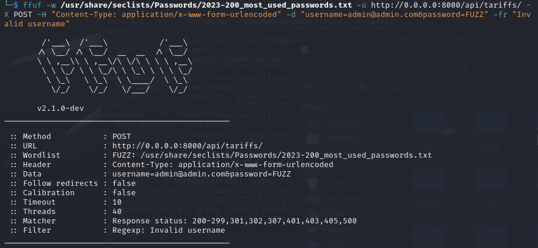
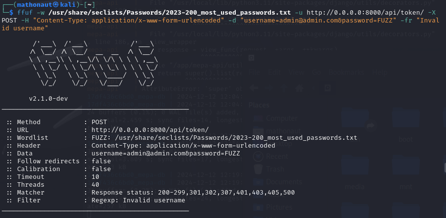
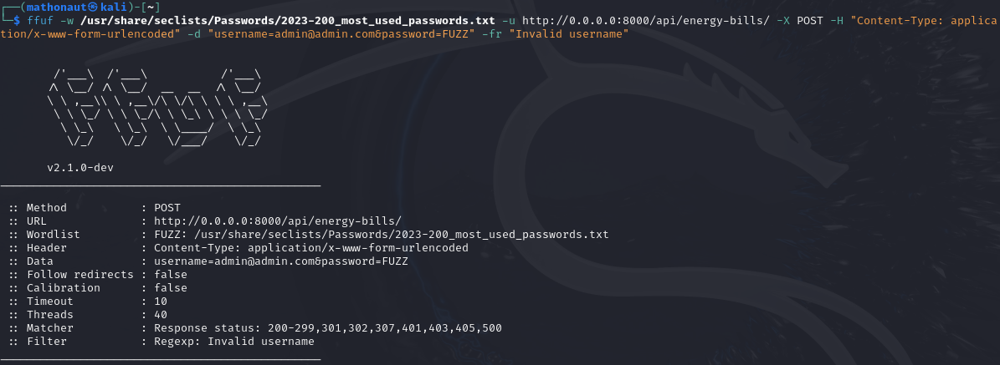
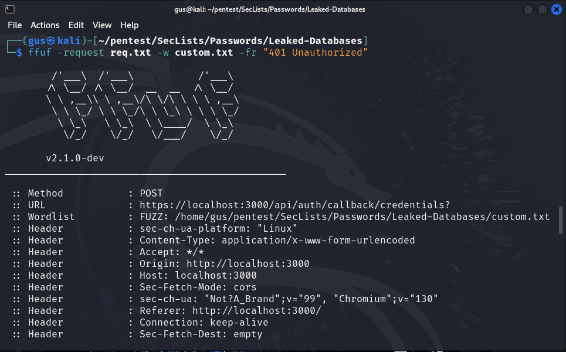
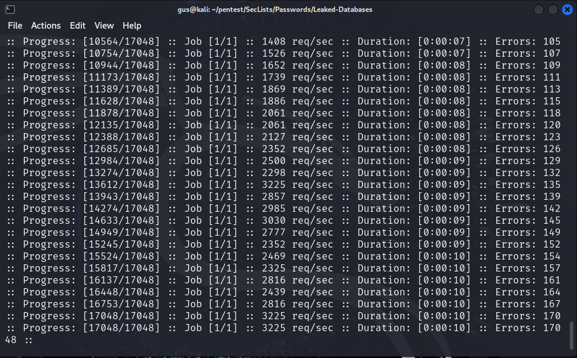
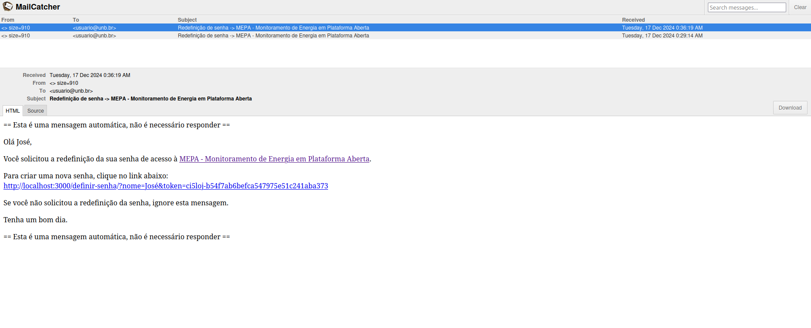
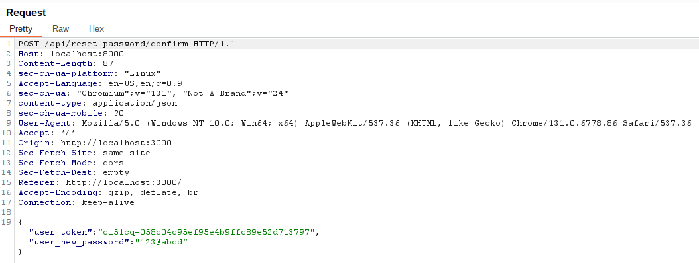

# Relatório da Sprint 2 do Grupo 2

## Relatório de Testes de Controle de Acesso Quebrado

**Objetivo:**  
O objetivo deste teste foi verificar a existência de vulnerabilidades de controle de acesso quebrado nas rotas da API fornecida, analisando possíveis falhas como Insecure Direct Object References (IDOR), operações inseguras sobre dados, e outras falhas relacionadas ao controle de acesso.

### 1. **Teste de Acesso Não Autorizado**

A primeira etapa envolveu testar as rotas da API sem autenticação para verificar se os controles de acesso estavam funcionando corretamente.

**Método:**

- Foi enviada uma requisição para cada rota sem um token de autenticação.
- As rotas testadas incluíram, entre outras, `/api/consumer-units/`, `/api/consumer-units/<pk>/`, `/api/consumer-units/create_consumer_unit_and_contract/`, e outras rotas com ou sem parâmetros de formato (`.json`, `.xml`).

**Resultado Esperado:**

- A resposta esperada era um código de status `401 Unauthorized` ou `403 Forbidden`, indicando que o acesso estava sendo corretamente restrito.

**Resultado Obtido:**

- Não foram encontradas falhas de acesso não autorizado. Todas as rotas que requeriam autenticação responderam corretamente com códigos de erro `401` quando o acesso foi realizado sem um token válido.

---

### 2. **Teste de Referências Diretas de Objetos Inseguras (IDOR)**

A segunda etapa envolveu a manipulação de parâmetros de URL (especificamente, o parâmetro `pk`) para verificar se o sistema permitia o acesso a recursos de outros usuários.

**Método:**

- Foram feitas requisições para acessar recursos de `ConsumerUnit` alterando o valor do `pk` na URL, para tentar acessar registros de outros usuários.
- Por exemplo, tentaram-se acessar URLs como `/api/consumer-units/2/`, `/api/consumer-units/3/` para testar se o acesso era permitido a objetos aos quais o usuário não deveria ter acesso.

**Resultado Esperado:**

- A resposta esperada era um código `403 Forbidden` ou `404 Not Found`, indicando que o usuário não tinha permissão para acessar objetos que não estavam associados a ele.

**Resultado Obtido:**

- Não foram observadas falhas de IDOR. O sistema corretamente impediu o acesso a recursos que não pertenciam ao usuário autenticado, retornando os códigos de status esperados (`404 Not Found`) para os recursos não autorizados.

---

### 3. **Teste de Operações Inseguras sobre Dados**

A terceira etapa consistiu em verificar se o sistema permitia que os usuários modificassem ou criassem dados que não deveriam ser acessíveis a eles.

**Método:**

- Foram enviadas requisições de edição e criação de dados em rotas como `/api/consumer-units/edit_consumer_unit_and_contract/` e `/api/consumer-units/create_consumer_unit_and_contract/`, tentando alterar dados de `ConsumerUnit` para os quais o usuário não deveria ter permissão.
- Utilizou-se o método POST para enviar dados falsificados para alterar ou criar registros de unidades de consumo.

**Resultado Esperado:**

- A resposta esperada era um código `403 Forbidden` ou uma mensagem de erro informando que o usuário não tinha permissão para realizar tais operações.

**Resultado Obtido:**

- O sistema respondeu corretamente, impedindo qualquer tentativa de alteração ou criação de dados para os quais o usuário não tinha permissão. Nenhuma operação insegura foi permitida.

---

### 4. **Teste de Exposição de Dados Sensíveis**

Foram realizados testes para verificar se dados sensíveis estavam sendo expostos a usuários não autorizados.

**Método:**

- Foram feitas requisições para obter dados de unidades de consumo usando diferentes valores de `pk`, testando a possibilidade de acessar informações sensíveis de outros usuários.

**Resultado Esperado:**

- A resposta esperada era um código `403 Forbidden` ou `404 Not Found`, garantindo que dados sensíveis não fossem expostos a usuários não autorizados.

**Resultado Obtido:**

- Nenhum dado sensível foi exposto indevidamente. O sistema implementou controles de acesso adequados, evitando a exposição de informações sensíveis.

---

### 5. **Teste de Manipulação de URL**

Neste teste, foi verificado se a manipulação de parâmetros de URL, como a mudança de formato (`.json`, `.xml`), poderia permitir o acesso não autorizado ou a alteração do comportamento da API.

**Método:**

- Foram feitas requisições com diferentes parâmetros de formato, como `/api/consumer-units/1.json` e `/api/consumer-units/1.xml`, para verificar se a manipulação de formato afetava o controle de acesso.

**Resultado Esperado:**

- A resposta esperada era que a manipulação de formato não tivesse impacto no controle de acesso e que as respostas fossem apropriadas conforme os controles de autenticação e autorização.

**Resultado Obtido:**

- Não foram encontradas falhas nesse aspecto. A manipulação de formato não causou falhas no controle de acesso e o sistema respondeu adequadamente a cada tipo de formato.

---

### 6. **Teste de Sobrescrição de Métodos HTTP**

Foi verificado se o sistema permitia a sobrescrição de métodos HTTP, uma prática que pode comprometer a segurança e permitir operações não autorizadas.

**Método:**

- Tentou-se enviar uma requisição `POST` com o cabeçalho `X-HTTP-Method-Override` configurado para métodos como `DELETE`, `PUT` e `PATCH`.

**Resultado Esperado:**

- O sistema deveria impedir a sobrescrição de métodos e retornar um erro de permissão ou operação não permitida.

**Resultado Obtido:**

- Não foi possível sobrescrever os métodos HTTP de forma bem-sucedida. O sistema impediu que qualquer método não autorizado fosse executado.

---

### Conclusão

Após a execução dos testes de controle de acesso quebrado nas rotas da API, **não foram encontradas vulnerabilidades** até o momento. Todas as rotas testadas responderam conforme esperado, com os controles de acesso funcionando corretamente, evitando acessos não autorizados e operações inseguras. Não foram observadas falhas de IDOR, manipulação de URL ou exposição de dados sensíveis.

## Relatório de Ataque da Aplicação com Ffuf

**Objetivo:**  
O objetivo deste teste foi verificar a existência da possibilidade de se obter as credenciais de acesso nas rotas da API fornecida.

### **Teste das rotas**

Essa etapa envolveu testar as rotas da API na tentativa de se obter a senha de um usuário com o e-mail já conhecido.

**Método:**

- Foi enviada uma requisição para cada rota com o username *admin@admin.com* e senhas vindas de um arquivo com as senhas mais utilizadas no ano de 2023.
- As rotas testadas foram: _/api/tariffs/_, _/api/token/_, _/api/token/logout/_, e _/api/energy-bills/_.
- Foi utilizado o seguinte comando: _ffuf -w /usr/share/seclists/Passwords/2023-200_most_used_passwords.txt -u http://0.0.0.0:8000/api/rota -X POST -H "Content-Type: application/x-www-form-urlencoded" -d "username=admin@admin.com&password=FUZZ" -fr "Invalid username"_.

  **Obs.: Para os testes a senha do usúario padrão foi alterada.**

**Resultado Esperado:**

- Código de status `401 Unauthorized`, indicando que se não obteve o acesso às credenciais.

**Resultado Obtido:**

- O resultado foi o esperado e as credenciais do usuário não foram acessadas. Em todas as rotas testadas o código de erro `401` foi lançado. As figuras 1.1 a 1.4 mostram os testes realizados.

Figura 1.1 - Teste da rota /tariffs/ da APIs.

Figura 1.2 - Teste da rota /token/ da API.

Figura 1.3 - Teste da rota token/logout/ da API.

Figura 1.4 - Teste da rota /energy-bills/ da API.

## Relatório de Teste de Rate Limit com Ffuf

**Objetivo:**  
O objetivo deste teste foi verificar se existe algum controle de limite de requisições na aplicação que inviabilizaria um ataque brute-force.

### **Teste das rotas**

Essa etapa envolveu testar as rotas do frontend (mais especificamente tela de login) na tentativa de observar se existe algum mecanismo que inviabilizaria o brute-force.

**Método:**

- Foi enviada uma requisição para cada rota com o username *admin@admin.com* e senhas vindas de um arquivo customizado com as senhas mais utilizadas no ano de 2023.
- A rota testada foi: _/api/auth/callback_.
- Foi utilizado o seguinte comando: _ffuf -request req.txt -w custom.txt -fr "401 Unauthorized"_.

  **Obs.: Para os testes a senha do usúario padrão foi alterada.**

Figura 2.1 - Teste da rota /api/auth do Frontend.

Figura 2.2 - Resultado do teste da rota /api/auth do Frontend.

**Resultado Obtido:**

- O resultado foi que a aplicação permitiu o brute-force e assim deixou serem realizadas 17048 requisições em um curto espaço de tempo.
- Importante ressaltar que esse teste foi feito no ambiente de desenvolvimento, contudo analisando os arquivos de [infra](https://gitlab.com/lappis-unb/projetos-energia/mec-energia/mepa-infra) do MEPA no repositório verifiquei que os arquivos de configuração do NGINX não possuem parâmetros *limit_req* que configuram limites de requisições. Além disso a aplicação não utiliza de CAPTCHAs ou bibliotecas como _django-ratelimit_ que ajudam a impedir a automatização de requisições.

## Relatório de Teste de Reset Password

**Objetivo:**  
O objetivo deste teste foi verificar se a funcionalidade de reset de senha possui alguma vulnerabilidade que possa ser explorada.

### **Teste das rotas**

Essa etapa envolveu testar rotas de esqueci e redefinir senha na tentativa de observar se existe alguma maneira de alterar variáveis da requisição a modo de mudar o comportamento ou verificar se o token utilizado é passível de brute-force.

**Método:**

- Foi configurado um contâiner docker de _mailcatcher_ no _compose.yml_ de desenvolvimento para auxiliar na visualização dos emails enviados pela aplicação via SMTP.
- Com a ferramenta BurpSuite foi interceptada a requisição de redefinição de senha.
- As rotas testadas foram: _/definir-senha_ e _/api/reset-password/confirm_.

Figura 3.1 - Mailcatcher configurado para interceptar emails da aplicação.

Figura 3.2 - Requisição de reset de senha interceptada no BurpSuite.

**Resultado Obtido:**

- A requisição não possui vulnerabilidades pois o único payload além da senha alterada é o próprio token que valida a requisição. Qualquer mínima alteração nesse token invalida a requisição e após seu uso o token é invalidado o que impede que algum usuário malicioso que interceptasse a requisição tentasse reutilizar o token.
- O token é formado por hash HMAC através de uma biblioteca do próprio Django, o comprimento da hash junto do seu espaço de busca e curto tempo de vida impossibilita que os tokens sejam quebrados ou adivinhados.

## Histórico de Versões

| Versão | Data       | Descrição                                  | Autor(es)                                        |
| ------ | ---------- | ------------------------------------------ | ------------------------------------------------ |
| `1.0`  | 10/12/2024 | Adiciona relatório inicial da sprint 2.    | [Gabriel Campello](https://github.com/G16C)      |
| `2.0`  | 12/12/2024 | Adiciona relatório de Matheus da sprint 2. | [Matheus Henrique](https://github.com/mathonaut) |
| `3.0`  | 16/12/2024 | Adiciona relatório do Gustavo da sprint 2. | [Gustavo Melo](https://github.com/gusrberto) |
| `4.0` | 17/12/2024 |  Adiciona relatório do Felipe Direito da sprint 2. | [FelipeDireito](https://github.com/felipedireito) |
