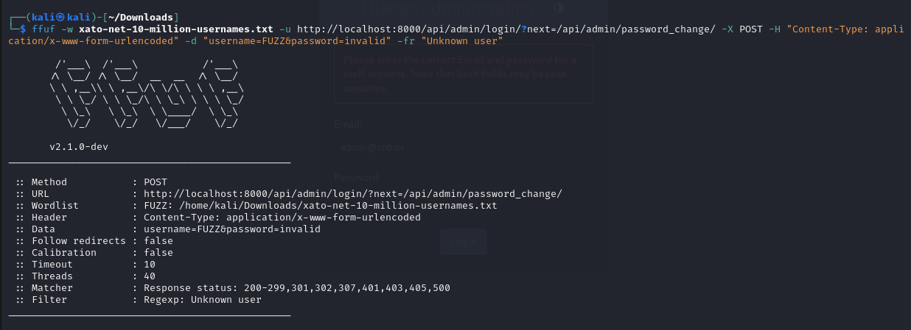

# Relatório Sprint 2 - Broken Authentication

## Membros

| Nome | Matrícula |
| :--: | :-------: |
| [Mateus Fidelis](https://github.com/MatsFidelis) | 200073184 |
| [Pablo Guilherme](https://github.com/PabloGJBS) | 200025791 |
| [Pedro Lucas](https://github.com/AlefMemTav) | 190115548 |
| [Rafael Bosi](https://github.com/strangeunit28) | 211029559 |

## Sobre

Este relatório é destinado a documentar as descobertas...

## O que é Broken Authentication

Broken Authentication é uma classe de vulnerabilidades que ocorre quando os mecanismos de autenticação de um sistema não são implementados de forma segura, permitindo que atacantes se façam passar por usuários legítimos. Algumas das formas mais comuns de exploração incluem:

- **Weak password policies:** Senhas fracas ou facilmente adivinháveis permitem que atacantes acessem contas através de ataques de força bruta ou dicionário.
- **Session fixation:** Ataques que forçam um usuário a utilizar uma sessão específica, permitindo que o atacante assuma o controle da sessão.
- **CSRF (Cross-Site Request Forgery):** Ataques que forçam um usuário autenticado a executar ações indesejadas em um aplicativo web.
- **Brute force attacks:** Tentativas exaustivas de adivinhar credenciais de login.

## Exemplo de Broken Authetication

Exemplo: Falha de autenticação por força bruta

- No módulo 80 do Hack The Box, uma das vulnerabilidades encontradas envolvia a possibilidade de realizar ataques de força bruta contra o mecanismo de autenticação. A ausência de uma política de bloqueio de tentativas de login após um número específico de falhas permitiu que os atacantes adivinhassem as credenciais de login de forma relativamente rápida. O mesmo podendo ser aplicado a aplicações que utilizam tokens previsiveis de digitos simples.

## Teste de Broken Authentication na API do MEC Energia

### Teste com o **_FFUF_**

Utilizando a ferramenta FFUF, conseguimos realizar testes de força-bruta para tentar identificar possíveis nomes de usuários que estão cadastrados na aplicação. Para isso conseguimos utilizar uma base de dados OSINT que nos auxilia a testar diferentes possibilidades, nos entregando valores que correspondem a nossa pesquisa. Para o caso da API do MEC - energia, não foram encontrados email's ou nomes de usuários que poderiam estar cadastrados, até porque a forma como está implementada os requisitos de segurança, não nos permite realizar essas deduções.

  

**Imagem 1** - Explorando a aplicação web com _FFUF_

### Teste com o **_burpSuite_**

Uma vez que os testes focados nas rotas da API não tenham evidenciado vulnerabilidades significativas, decidimos expandir nossa análise para a aplicação web como um todo. Utilizando a ferramenta Burp Suite, interceptamos a requisição HTTP da página de login com o objetivo de manipular o token de autenticação e elevar os privilégios de um usuário comum para um perfil de administrador. No entanto, após diversas tentativas de adulteração do token, não conseguimos obter sucesso. Essa resistência pode indicar que a aplicação implementa mecanismos robustos de autenticação e autorização, como validação do lado do servidor, assinatura de tokens e controle de acesso baseado em papéis.

  

**Imagem 1** - Explorando a aplicação web com _BurpSuite_

## Dificuldades encontradas

### Mateus Fidelis

Nesta sprint, as dificuldades em encontrar vulnerabilidades na aplicação se estenderam mais por minha parte ao estudo e entendimento do contexto, pois cada ação que vamos tomar exige um nível mais alto de conhecimento prático e teórico do que estamo fazendo, cada parametro precisa ser muito bem pesquisado para que gere um resultado mais compreensível. No fim os testes automaticos e manuais não demonstraram nenhuma vulnerabilidade ou falta de prática de segurança no desenvolvimento.

### Pablo Guilherme

Comparando o módulo de mysql injection com o módulo atual, notei uma diferença significativa em termos de complexidade. Enquanto o primeiro se concentrava em falhas mais simples de input, o segundo exigiu uma compreensão mais profunda de possiveis vulnerabilizades da aplicação tal qual um entendimento maior de como procurar um ponto fraco. A ausência de uma ferramenta tão específica quanto a sqlmap do modulo anterior para o módulo atual tornou o processo de aprendizado mais desafiador, uma vez que as eventuais falhas poderiam ser variadas, mas no final o aprendizado e a aplicação do conhecimento foi mais gratificante.

### Pedro Lucas

### Rafael Bosi

## Referências