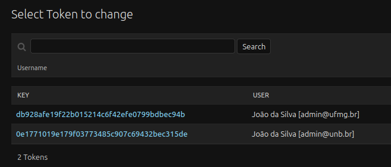
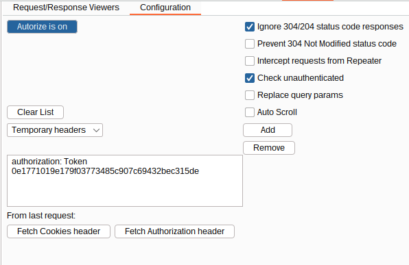
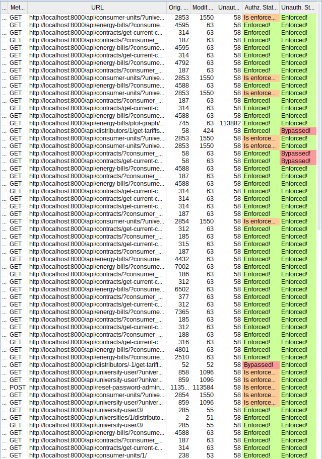
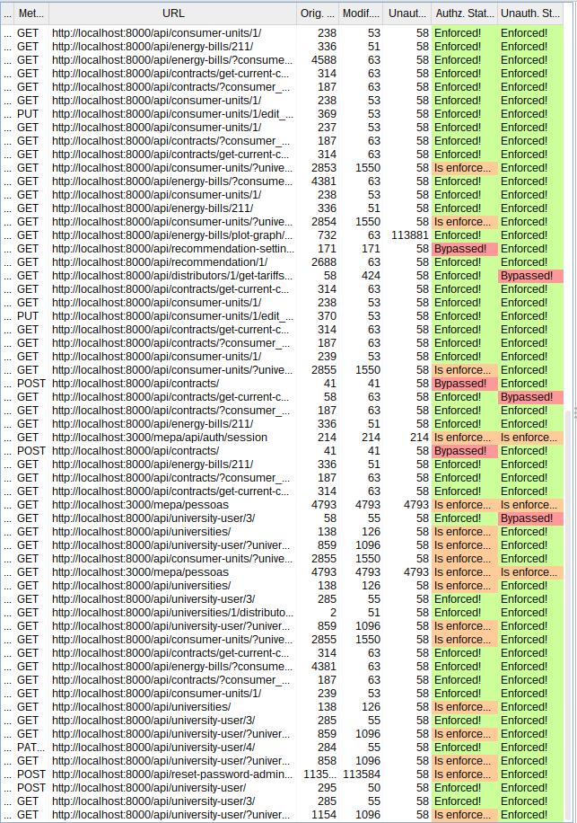
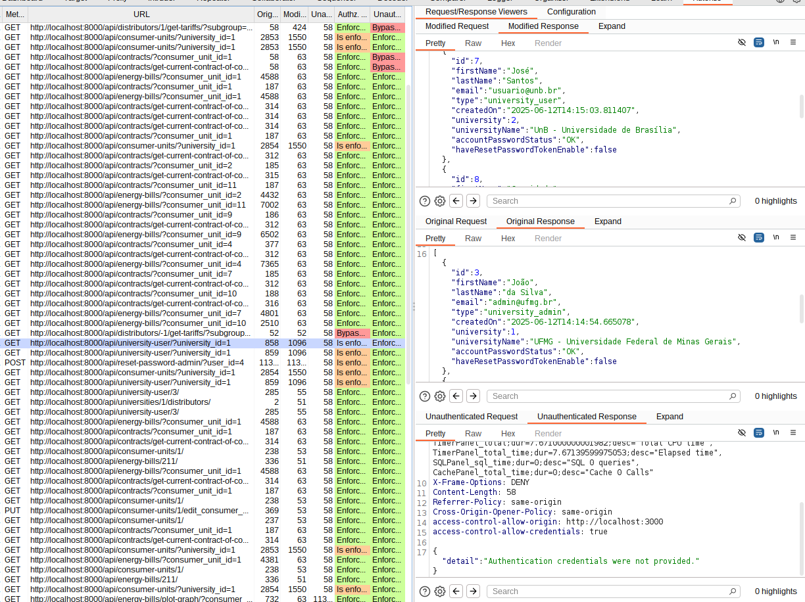
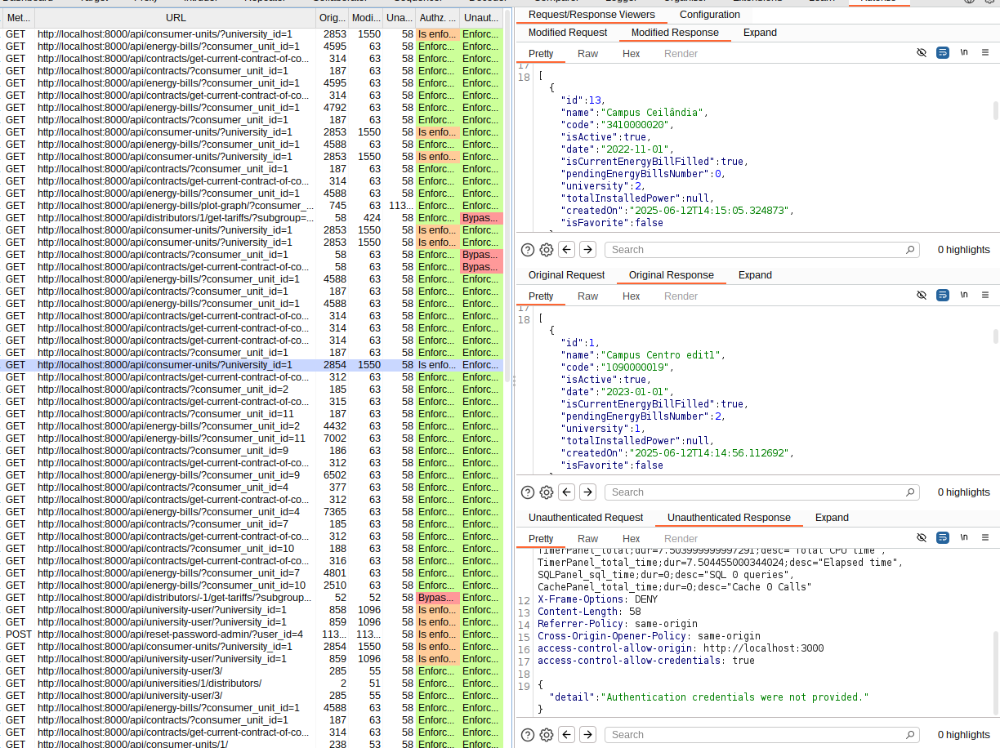
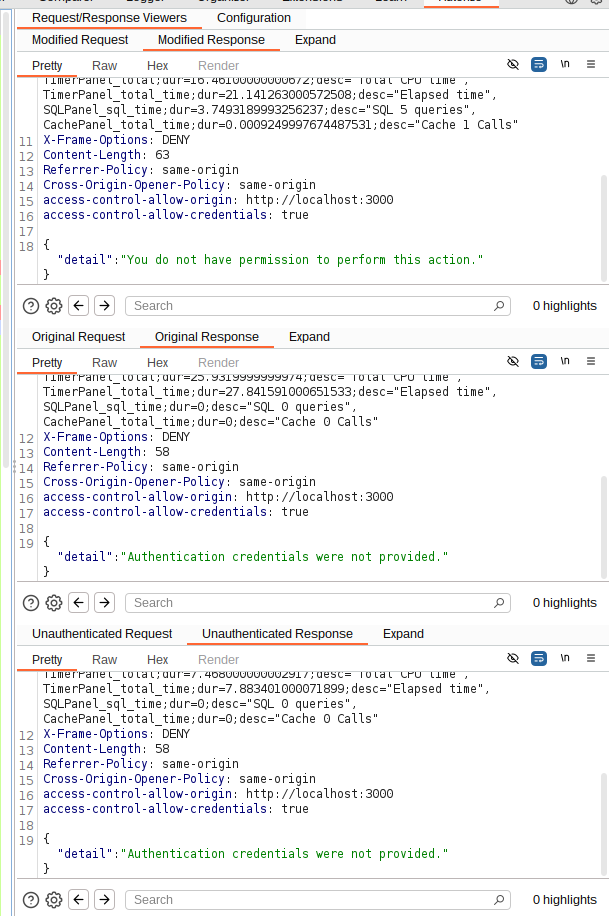

# Relatório Sprint 2

## MEPA RED TEAM

* **Carlos – 221031265**

---

## Atividades realizadas

Durante esta sprint, o foco foi na identificação e exploração da vulnerabilidade **IDOR (Insecure Direct Object Reference)** na aplicação MEPA. As principais atividades foram:

* **Configuração do Burp Suite e da extensão Autorize.**
* **Execução de testes práticos de IDOR na API do MEPA.**
* **Análise e interpretação dos resultados obtidos.**

---

## Configuração do Ambiente para Teste de IDOR

### 1. Instalação do Burp Suite

* Baixamos e instalamos o Burp Suite Community Edition diretamente do site oficial.

### 2. Instalação do Jython (Pré-requisito para o Autorize)

* Baixamos o Jython através do site oficial.

* No Burp, acessamos Extensions → Extensions Settings → Python Environment e configuramos o caminho para o arquivo `jython.jar`.

### 3. Instalação da Extensão Autorize

* Após configurar o Jython, acessamos **Extensions → BApp Store**, buscamos por **Autorize** e clicamos em install.

### 4. Configuração do Autorize

* Selecionamos dois dos usuários cadastrados na plataforma (um da UFMG e outro da UnB):

  * O usuário da UFMG foi usado para navegar normalmente pela aplicação.
  * No Autorize, inserimos o token do usuário da UnB.

* O Autorize então intercepta cada requisição feita ao navegarmos pelo MEPA utilizando a conta do usuário da UFMG e replica utilizando o token do usuário da UnB, possibilitando a identificação de falhas de autorização.

---

## Funcionamento do Autorize

### Interpretação dos Status

## **Significado dos status no Autorize:**

* 🟢 **Enforced**: O controle de acesso está **aplicado corretamente**. A requisição feita com o usuário autorizado foi aceita, **e a tentativa com outro usuário foi bloqueada**.

* 🟠 **Is Enforced?**: O controle **aparentemente está aplicado**, porque a resposta da requisição paralela com outro usuário foi diferente ou parece bloqueada, **MAS** o Autorize não tem certeza absoluta se isso é efetivamente um bloqueio ou só uma diferença superficial. Indica que precisamos verificar manualmente se é de fato um bloqueio ou um falso positivo/negativo.

* 🔴 **Bypassed**: **Falha de autorização confirmada (IDOR)**. A requisição feita com as credenciais de outro usuário foi aceita normalmente, indicando uma vulnerabilidade crítica de controle de acesso.

## Testes realizados

* O objetivo era verificar se o usuário da **UnB** conseguia acessar dados da **UFMG**, o que não deveria ser permitido.

## Resultados Obtidos

Durante a análise dos endpoints, observou-se que algumas requisições foram classificadas pela ferramenta como “Bypassed” (em vermelho) e “Is Enforced?” (em laranja). Contudo, após análise manual das respostas, constatou-se que:

* As requisições classificadas como “Bypassed” tratam-se, na verdade, de falsos positivos. Nenhuma das "falsas" requisições retornou dados da UFMG.

* As requisições identificadas como “Is Enforced?” retornaram dados, porém apenas informações vinculadas à UnB, o que confirma que o controle de autorização foi corretamente aplicado.

> Exemplo de "Is Enforced?": A requisição retornou apenas dados relacionados à universidade à qual o usuário está vinculado, indicando que o controle de autorização está funcionando corretamente.

 

> Outro exemplo de "Is Enforced?".

 

> Exemplo de um caso de falso positivo.

