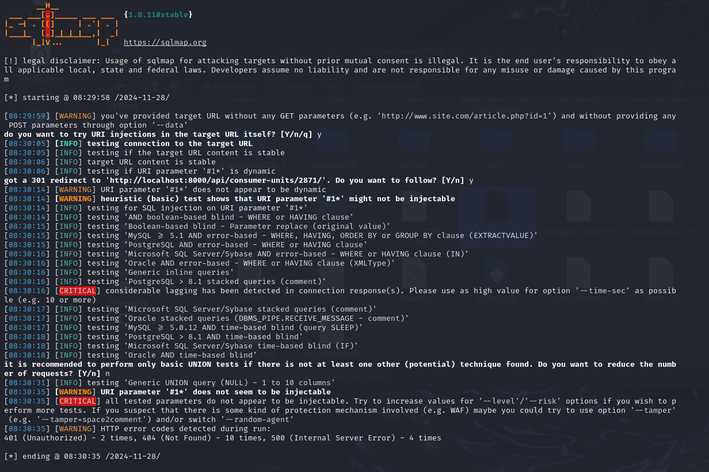
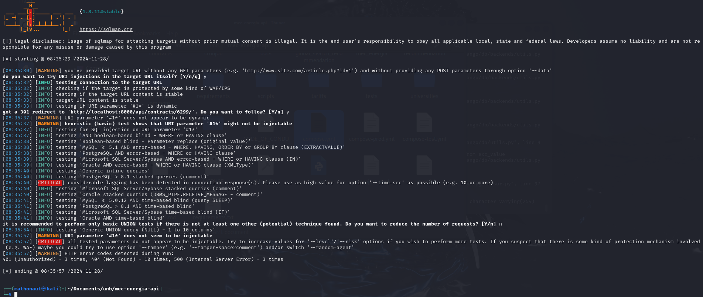
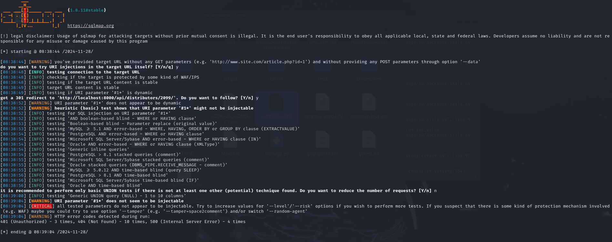
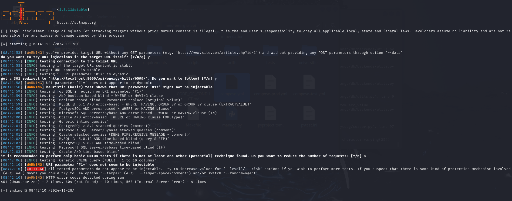
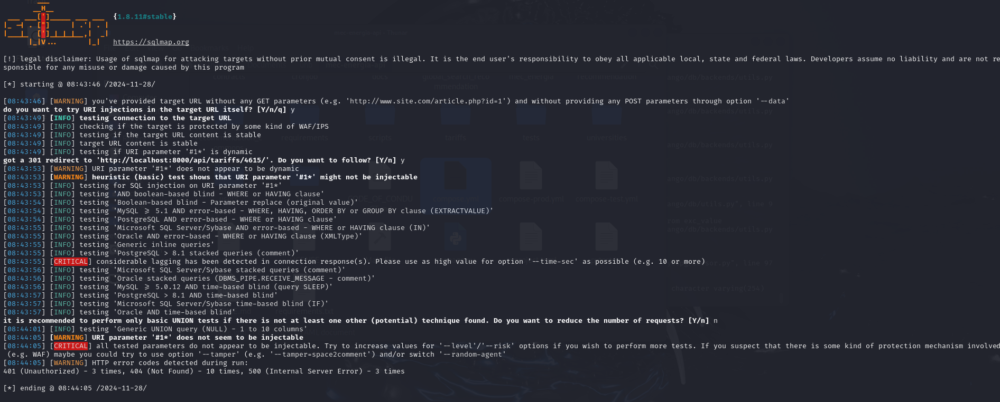

# Relatório da Sprint 1 - Gabriel Campello Marques

Durante essa primeira sprint eu acessei os cursos do HTB (Hack the Box) como solicitado pelo Rodolfo e fiz o primeiro módulo para essa sprint SQL Injection Fundamentals, resolvi o que foi solicitado e finalizei esse módulo. Então optei por concentrar primeiramente meus esforços em subir o ambiente do MEC energia no meu PC. Após finalizar a etapa de instalação das dependências e do próprio ambiente comecei a explorar a plataforma do MEC energia acessando via admin para decidir começar testes para a rota do subgrupo 2 o qual fui designado.

A seguir apresento o retorno de alguns desses testes.

Figura 1.1 - Teste 1:  
![][image1]

Figura 1.2 - Teste 2:  
![][image2]

Figura 1.3 - Teste 3:  
![][image3]

Figura 1.4 - Teste 4:  
![][image4]

Depois de aplicar os testes e utilizar as flags sugeridas para tentar encontrar brechas pude concluir que não houveram falhas de segurança na rota /api/consumer-units/ Pretendo agora focar em toda a rota relacionada para chegar a mais resultados

[image1]: /2024.2/relatorio/sprint_1/img_g2/image1.png
[image2]: /2024.2/relatorio/sprint_1/img_g2/image2.png
[image3]: /2024.2/relatorio/sprint_1/img_g2/image3.png
[image4]: /2024.2/relatorio/sprint_1/img_g2/image4.png

# Relatório da Sprint 1 - Matheus Henrique Dos Santos

## Introdução

Nesse sprint meu foco foi em realizar os cursos recomendados pelo monitor do grupo ([Rodolfo](https://github.com/roddas)) na plataforma [Hack The Box](https://www.hackthebox.com/), no caso os módulos **SQL Injection Fundamentals** e **SQLMap Essentials**. No decorrer dos estudos dos módulos citados, também, _“subi”_ o ambiente de teste do grupo, no caso a aplicação MEC-Energia.

## Metodologia

Para realizar os testes das rotas proposta para essa sprint, foi realizada a configuração do ambiente de teste que consistia de uma máquina virtual contendo a versão 2024.3 do OS Kali Linux. Dentro da máquina virtual foram instaladas as ferramentas **Docker**, **Git**, **NPM** e **SQLMap** para que o ambiente de teste da aplicação fosse configurado corretamente para o teste da aplicação proposta ([MEC-Energia](https://gitlab.com/lappis-unb/projetos-energia/mec-energia)). Em relação a aplicação, a sua configuração foi realizada seguindo as instruções propostas pela página no GitLab. Realizada todas essas configurações, foram realizados os testes com SQLMap das [rotas propostas](https://github.com/FGA-GCES/OWASP/blob/main/2024.2/url_mec_energia.txt) do sub grupo 2 no intuito de encontrar vulnerabilidades do tipo SQL Injection.

## Testes

Para essa primeira primeira interação, foram utilizados apenas a flag _--ignore-code=401_, as rotas bases e a [API da aplicação](https://gitlab.com/lappis-unb/projetos-energia/mec-energia/mec-energia-api). O motivo da utilização da flag mencionada se deve ao fato de falhas na autenticação, outras flag não foram utilizadas devido a falta de familiaridade com a aplicação. As figuras 2.1 a 2.5 mostram os resultados.

Figura 2.1 - Teste da rota na API de consumer-units.

Figura 2.2 - Teste da rota na API de contracts.

Figura 2.3 - Teste da rota na API de distributors.

Figura 2.4 - Teste da rota na API de energy-bills.

Figura 2.5 - Teste da rota na API de tariffs.

## Conclusão

Sendo assim, realizados os testes, não foram detectadas vulnerabilidades referentes à injeção de SQL nas rotas testadas. Já sobre a experiência, tive certa dificuldade em configurar o ambiente no Kali Linux e na realização dos cursos pela plataforma Hack The Box, pois a mesma possui algumas limitações para contas não pagantes que dificultam o progresso rápido nos cursos. Por fim, pretendo aprimorar meu conhecimento na ferramenta SQLMap para realizar testes mais profundos nas rotas.

# Membro 3

# Membro 4

## Bibliografia

> 21Y4D. **SQL Injection Fundamentals**. HTB ACADEMY, 2024. Disponível em: <<https://academy.hackthebox.com/module/details/33>>. Acesso em: 23 de nov. de 2024.

> STAMPARM. **SQLMap Essentials**. HTB ACADEMY, 2024. Disponível em: <<https://academy.hackthebox.com/module/details/58>>. Acesso em: 25 de nov. de 2024.

## Histórico de Versões

| Versão | Data       | Descrição                                  | Autor(es)                                        |
| ------ | ---------- | ------------------------------------------ | ------------------------------------------------ |
| `1.0`  | 27/11/2024 | Adiciona relatório do Gabriel da sprint 1. | [Gabriel Campello](https://github.com/G16C)      |
| `1.1`  | 28/11/2024 | Adiciona relatório do Matheus da sprint 1. | [Matheus Henrique](https://github.com/mathonaut) |
