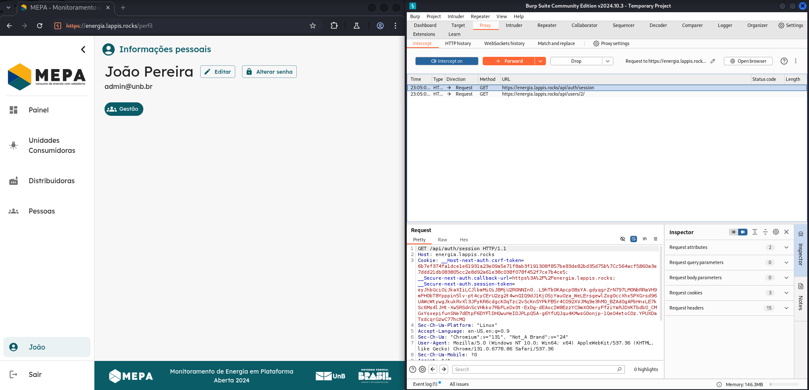
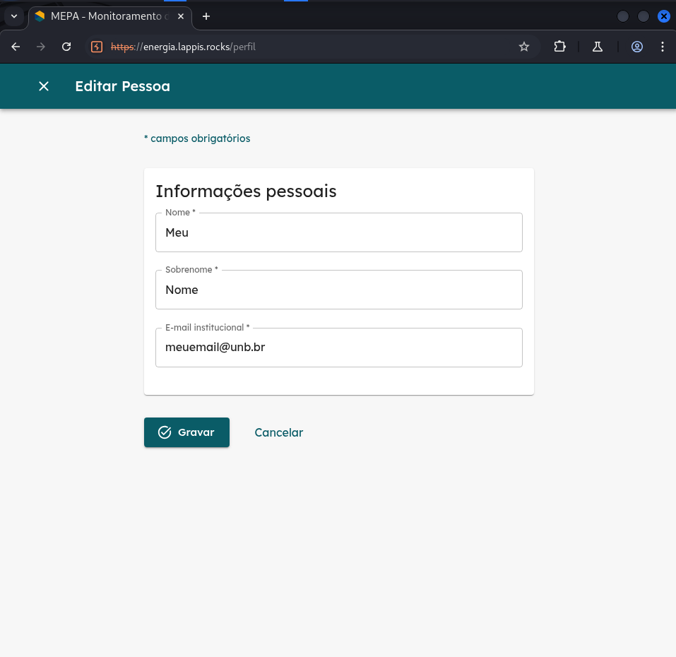
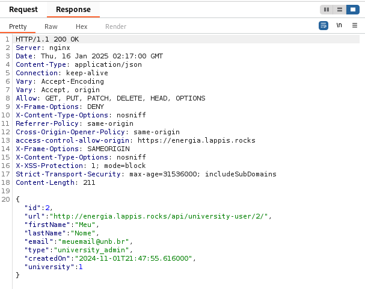
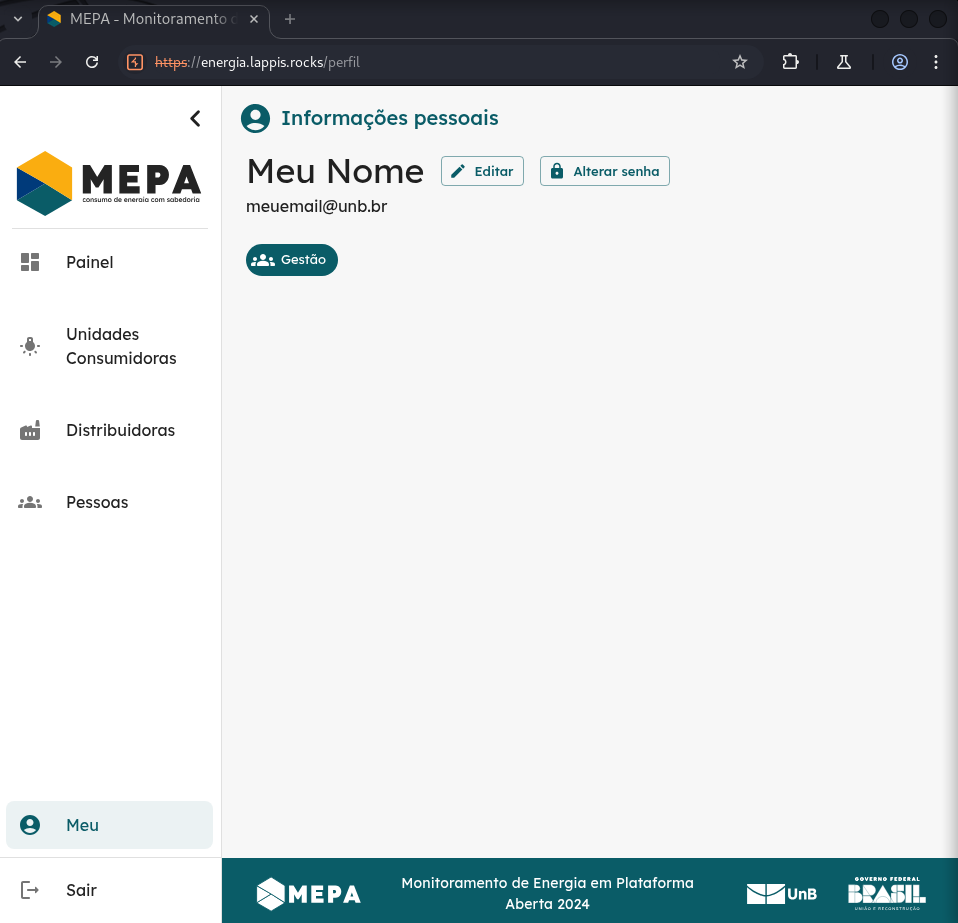

# Relatório Sprint 3 - Insecure Direct Object References

## Membros

| Nome | Matrícula |
| :--: | :-------: |
| [Felipe Direito](https://github.com/felipedireito) | 190086971 |
| [Gabriel Campello](https://github.com/G16C) | 211039439 |
| [Gustavo Melo](https://github.com/gusrberto) | 211039457 |
| [Matheus Henrique](https://github.com/mathonaut) | 211029666 |

---

## 1. Teste de IDOR para alteração de dados de outro usuário

### Objetivos

O objetivo desse teste foi verificar se um usuário cadastrado na plataforma é capaz de alterar informações de outro usuário, que podem levar à tomada da conta por um usuário qualquer.

O teste foi realizado no ambiente de [homologação](https://energia.lappis.rocks/) do MEPA.

Para realização do teste foi utilizado a ferramenta de interceptação de requisições do _Burp Suite_, que age como um proxy sobre as requisições HTTP.

### Passo-a-passo

**1**. Os primeiros passos foram se autenticar na plataforma como um usuário de baixo privilégio (nesse caso `José` com cargo `Operacional`).

Figura 1.1 - Tela de Login.

**2**. Com o proxy do _Burp Suite_ ativado, vou interceptar a requisição de acesso ao perfil do `José`.

Figura 1.2 - Autenticado como José.

**3**. Como o parâmetro identificador de usuários é um simples ID sequencial, posso trocar o ID da requisição `GET` de 3 para 2.

Figura 1.3 - Requisição Original com ID `3`.

Figura 1.4 - Requisição Modificada com ID `2`.

**4**. Agora estou visualizando a página como o usuário de ID `2` que neste caso é o `João` que possui privilégios de `Gestão` (acima de José).

Figura 1.5 - Tela de Perfil pela visão do usuário `João`.

**5**. Com isso é possível acessar a página de Editar Pessoa como `João` e assim alterar suas informações (em especial seu email).

Figura 1.6 - Tela de Editar Pessoa pela visão do usuário `João`.

Figura 1.7 - Alterando as informações do usuário `João`.

**6**. Como o token de sessão não verifica se o usuário tem permissão de realizar essa operação, a requisição retorna com um status `200` e as informações realmente foram alteradas.

Figura 1.8 - Resposta da requisição no _Burp Suite_.

Figura 1.9 - Mensagem de sucesso mostrando que a pessoa foi editada.

**7**. Por fim se utilizarmos novamente do método do Passo 2, veremos que de fato as informações do usuário `João` foram alteradas.

Figura 1.10 - Novo usuário com informações alteradas.

Agora após esses passos o usuário `José` poderia pedir uma Redefinição de Senha para esta conta (que agora ele possui o email), e após a redefinição ele teria acesso total à uma conta de outro usuário, que ainda por cima possui privilégios superiores a sua conta original.

### Conclusão

O teste concluiu que existe uma **ALTA** vulnerabilidade na aplicação à ataques IDOR. Algumas possíveis melhorias seriam a implementação de uma política de controle de acesso no Back-End da aplicação, controle esse que utilizaria o token de sessão que a aplicação já possui para validar e verificar todas as requisições. Garantindo que um usuário no sistema possui permissão de realizar uma determinada ação.

Também recomendaria a utilização de IDs mais aleatórios e não-previsíveis que dificultaria o acesso à informações não autorizadas.

---

## Histórico de Versões

| Versão | Data       | Descrição                                  | Autor(es)                                        |
| ------ | ---------- | ------------------------------------------ | ------------------------------------------------ |
| `1.0`  | 16/01/2025 | Adiciona relatório inicial da sprint 3.    | [Gustavo Melo](https://github.com/gusrberto)      |