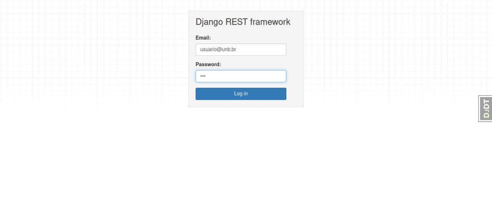
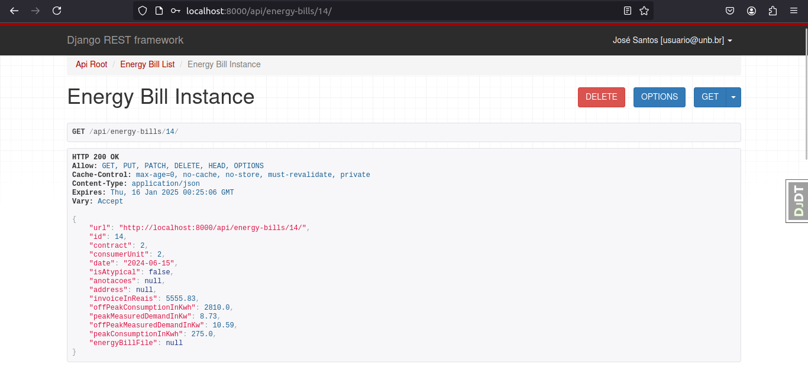
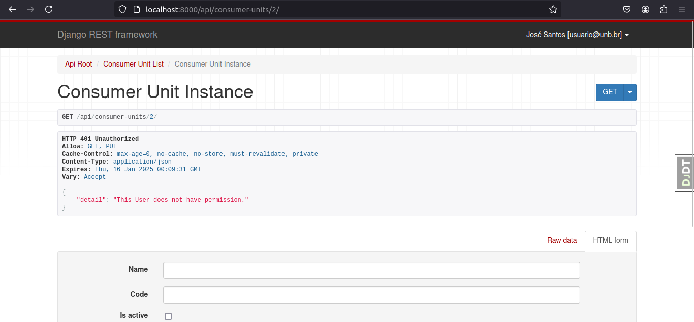
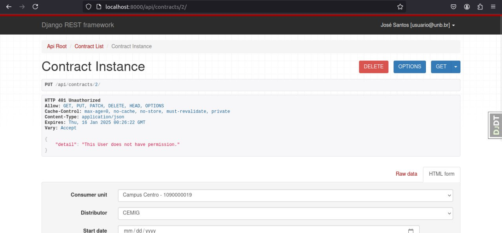
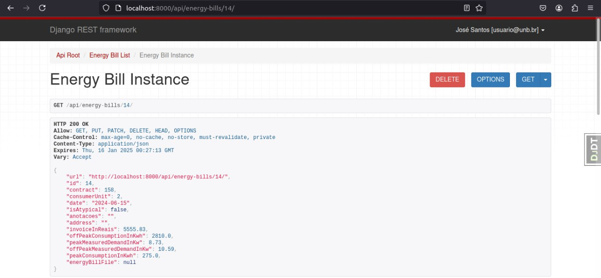
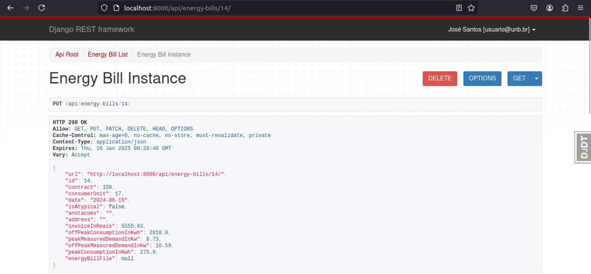
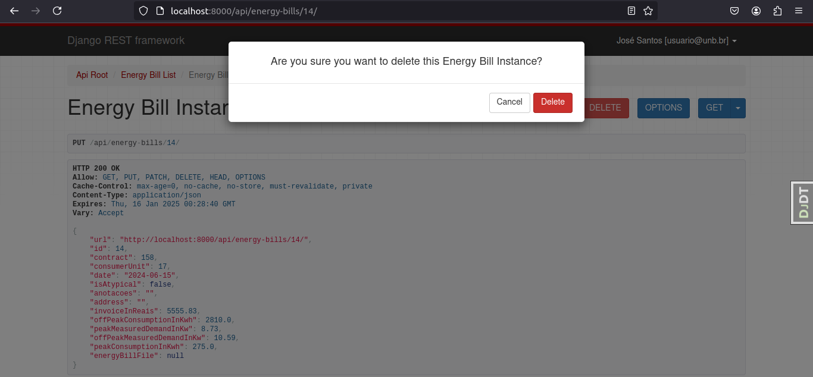
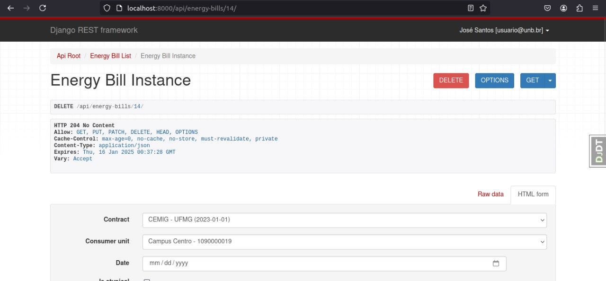

# Relatório Sprint 3 - Insecure Direct Object References

## Membros

| Nome | Matrícula |
| :--: | :-------: |
| [Mateus Fidelis](https://github.com/MatsFidelis) | 200073184 |
| [Pablo Guilherme](https://github.com/PabloGJBS) | 200025791 |
| [Pedro Lucas](https://github.com/AlefMemTav)     | 190115548 |
| [Rafael Bosi](https://github.com/strangeunit28) | 211029559 |

---

## Sobre 

Este relatório documenta os resultados alcançados durante a Sprint 3, com foco na vulnerabilidade conhecida como **Insecure Direct Object References (IDOR)**. O objetivo foi explorar, identificar e compreender como essa vulnerabilidade pode comprometer sistemas reais, além de detalhar testes realizados na API do MEC Energia, os desafios enfrentados e os aprendizados adquiridos pela equipe.

---

## O que é Insecure Direct Object References (IDOR)

**Insecure Direct Object References (IDOR)** é uma vulnerabilidade de controle de acesso que ocorre quando uma aplicação expõe referências diretas a objetos internos, como IDs ou nomes de arquivos, sem validação apropriada. Isso permite que um atacante acesse, modifique ou exclua dados de outros usuários ao manipular essas referências.

Exemplos comuns de IDOR incluem:

- **IDs expostos**: Manipulação de parâmetros de requisição, como `/user/12345`, para acessar informações de outros usuários.
- **URLs parametrizadas sem validação**: Utilização de endpoints que não validam se o usuário tem permissão para acessar o recurso solicitado.
- **Falhas em verificações de permissões**: Acesso a recursos sensíveis devido à ausência de validação de privilégios.

---

## Exemplo de IDOR

### Cenário 1: Acesso não autorizado a dados de usuários

1. Um endpoint `/user/profile?id=123` permite acessar informações do perfil do usuário identificado pelo ID `123`.
2. O atacante altera o parâmetro para `/user/profile?id=124`, acessando os dados do usuário com ID `124` sem permissão.

**Prevenção:**
- Implementar controles de acesso baseados em permissões no backend.
- Validar se o usuário autenticado tem autorização para acessar o recurso solicitado.
- Utilizar identificadores indiretos (ex.: UUIDs) em vez de IDs sequenciais.

### Cenário 2: Modificação de dados alheios

1. Um formulário POST em `/order/update` aceita um parâmetro `orderId` e permite atualizações no pedido.
2. O atacante descobre o ID de outro pedido e envia: 
   ```json
   {
       "orderId": "567",
       "status": "Cancelled"
   }

Alterando o status de um pedido que não pertence a ele.

Prevenção:

- Verificar a propriedade do recurso antes de aplicar qualquer modificação.
- Implementar logs detalhados para monitorar alterações suspeitas.

## Teste de IDOR na API do MEC Energia

No ambiente de homologação do [MEC Energia](https://energia.lappis.rocks/) ao logar como qualquer usuário é possível acessar e modificar várias informações, o que não deveria ser possível. Isso occorre por meio de IDOR na API do sistema. Apartir dessas informações, aqui estão alguns exemplos do que é possível realizar dentro da plataforma e como fazer isso.

Faça login normalmente (qualquer usuário), como na imagem abaixo


**Imagem 1** - Tela de Login


Em seguida, abra a ferramenta de networking de seu navegador padrão para observar as requisições que estão sendo feitas para API. Com a ferramenta aberta, clique no nome do usuário no canto inferior esquerdo. Nesse caso, o nome do usuário é "José".


**Imagem 2** - Painel

Após clicar no usuário sua ferramenta de network deve ficar preenchida mais ou menos como a imagem abaixo.


**Imagem 3** - Vendo requisições


**Imagem 4** - Zoom nas requisições feitas

Dentre as requisições feitas à API existe uma com o arquivo _*api/users/3*_, ou seja, a requisição foi feita com o seguinte endereço: https://energia.lappis.rocks/api/users/3/

Detalhes da resposta dessa requisição na imagem abaixo.


**Imagem 5** - Resposta da requisição

Seguindo a _*url*_ à qual a requisição foi feita e realizando login com o mesmo usuário, nos deparamos com a seguinte tela (Imagem 6).


**Imagem 6** - Painel do usuário na API

Na imagem acima já é possível observar algumas coisas preocupantes. Mesmo tendo realizado o login com um usuário operacional, ou seja, a menor hierárquia de acesso, temos autorização de realizar requisições de todo tipo, menos POST.

```
HTTP 200 OK
Allow: GET, PUT, PATCH, DELETE, HEAD, OPTIONS
Content-Type: application/json
Vary: Accept
```

Isso significa que se conseguirmos acessar outros usuários apartir da API, poderiamos alterar informações ou mesmo deletar seu registro. Mas primeiro, não indo tão além, vamos tentar alterar alguma informação do nosso usuário.

No painel abaixo vemos algumas informações que são passíveis de alteração. Uma delas é um dropdown no atributo "Type". Nele temos 3 opções: "super_user", "university_admin" e "university_user". Nosso usuário possui o "Type: university_user", mas apatir daqui conseguimos colocar qualquer um dos valores disponíveis (Imagem 8). Optei por colocar o usuário como "super_user", pois possui a acesso total.


**Imagem 7** - Atributos do usuário


**Imagem 8** - Type do usuário alterado

Ao alterar o type, se voltarmos no painel da plataforma vemos uma alteração na sidebar e no tipo de cargo do usuário. Agora o usuário possui cargo de "super" e não mais "operacional", além disso, ganhamos acesso a todas as instituições que utilizam a plataforma (Imagem 10), além de ser possível criar uma nova instituição.


**Imagem 9** - Novo painel de perfil


**Imagem 10** - Listagem das intituições

Ainda nos é possível editar os dados das instituições.


**Imagem 11** - Editando dados das instituições

Além disso, temos acesso a todos os usuários da plataforma, podendo ainda alterar seus níveis de acesso e criar novos usuários.


**Imagem 12** - Listagem dos usuários

Voltando para a API, a url que acessamos possuia o "id" do usuário no final (api/users/3). Ao alterarmos esse "id", podemos acessar dados de outros usuários, como por exemplo ao alterar o final da url por "api/users/1". Tudo isso ainda logado como o usuário operacional.


**Imagem 13** - Dados do super usuário

Existem várias coisas preocupantes nesse acontecimento, primeiro que acessamos essa página apenas alterando o "id" na url, segundo que aqui conseguimos ter acesso a diversas informações do super usuário, como por exemplo seu email, mas de longe o mais importante, é possível deletar esse usuário.

## Teste IDOR deletando contas

### Introdução

Os testes realizados nesta seção focaram na identificação de vulnerabilidades do tipo IDOR (Insecure Direct Object Reference). Foram utilizadas as seguintes URLs para análise:

    - http://localhost:8000/api/energy-bills/14/
    - http://localhost:8000/api/consumer-units/2/
    - http://localhost:8000/api/contracts/2/

O objetivo principal foi verificar se diferentes tipos de requisições, como GET, POST, PUT e DELETE, possuem tratamento adequado para impedir o acesso não autorizado a recursos do sistema.

### Descrição

#### 1° passo

No exemplo apresentado, o usuário  `usuario@unb.br` com a senha `unb` não possui permissão para acessar a unidade consumidora com o ID  `2`, nem o contrato associado de ID `2`. No entanto, ele ainda consegue acessar a conta de energia vinculada a essa unidade consumidora e contrato, evidenciando uma falha no controle de acesso.



**Imagem 14** - Realizando login



**Imagem 15** - Vendo conta de energia de uma unidade consumidora e contrato



**Imagem 16** - Sem acesso à unidade consumidora



**Imagem 17** - Sem acesso ao contrato

#### 2° passo

Após confirmar que o usuário não possui acesso à unidade consumidora nem ao contrato associados à conta de energia, observa-se que é possível alterar o contrato e a unidade consumidora da conta de energia para qualquer outro contrato ou unidade consumidora. Além disso, o usuário também consegue excluir a conta de energia de qualquer unidade consumidora ou contrato, evidenciando uma grave falha no controle de permissões do sistema.



**Imagem 18** - Mudando contrato de uma conta de energia



**Imagem 19** - Mudando unidade consumidora de uma conta de energia



**Imagem 20** - Opção de deletar uma conta de energia de outra instituição



**Imagem 21** - Conta de energia deletada

### Resultado

Os testes revelaram que o sistema apresenta vulnerabilidades críticas. Foi possível acessar, editar e excluir dados de contas de energia pertencentes a outras instituições, o que representa uma grave falha de segurança. Essas vulnerabilidades ocorrem devido à falta de validações adequadas nos endpoints, permitindo que um usuário não autorizado realize operações em recursos que deveriam estar restritos.

### Sugestão de melhoria

- Implementar Controle de Acesso Baseado em Recursos (RBAC ou ABAC):
  - Utilizar controles de acesso no backend para validar se o usuário autenticado tem permissão para acessar, editar ou excluir o recurso solicitado.
  - Exemplo: Comparar o user_id da sessão com o owner_id do recurso antes de permitir qualquer operação.

- Verificação de Autorização nos Endpoints:
  - Para cada requisição (GET, POST, PUT, DELETE), implementar uma verificação no backend para assegurar que o recurso pertence ao usuário que está realizando a solicitação.

- Utilizar Identificadores Não Previsíveis (UUIDs):
  - Substituir os IDs incrementais (ex.: /api/contracts/2/) por identificadores únicos (UUIDs).
  - Exemplo: /api/contracts/550e8400-e29b-41d4-a716-446655440000/

## Dificuldades encontradas

## Referências

- OWASP Foundation: Broken Access Control
- PortSwigger Web Security: IDOR Vulnerability Guide
- API Security Testing - OWASP ZAP Documentation
